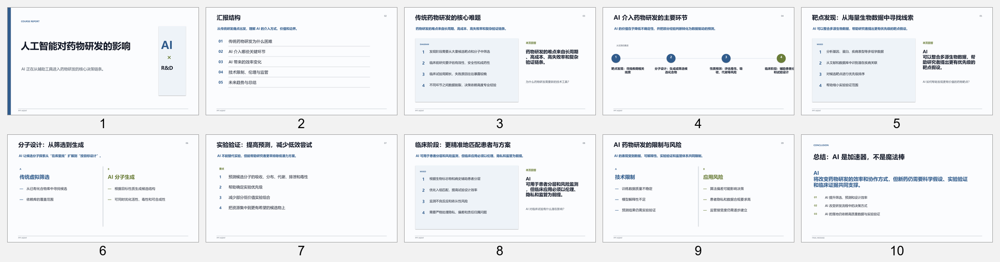
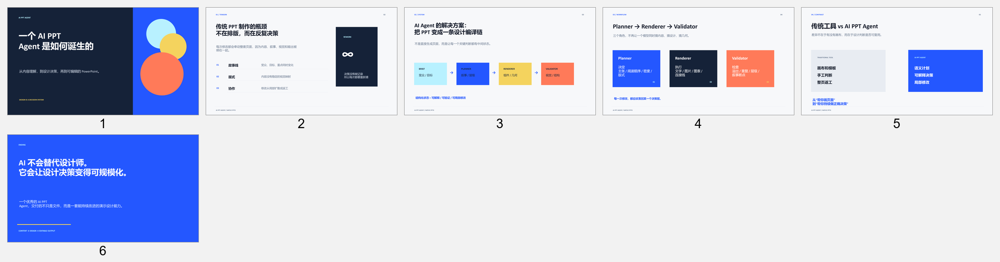

# PPT Design Compiler

一个本地优先、可扩展的 AI PPT Agent。它把“用户想讲什么”逐步转换成“每一页应该如何表达”，最后生成可编辑的 PowerPoint 文件。

```text
需求 -> Brief -> Outline -> Slide Plan -> Design Plan -> Render Plan -> PPTX
```

项目当前包含两层能力：

- `agent/`：可被 Luna 或其他模型调用的 PPT Agent Runtime
- `design-library/`、`templates/`：页面类型、布局、主题和设计规则

## 能做什么

- 需求澄清：把自然语言需求整理成结构化 Brief
- 故事线与大纲：生成并确认演示文稿结构
- Design Planner：为每页选择页面类型、布局、视觉形式和信息密度
- Layout Engine：根据布局注册表计算稳定的元素 frame 和 fit 状态
- PPTX Renderer：生成可编辑的 PowerPoint
- 模板与 Skill 自动发现：后续可以直接添加模板或接入新的 Skill
- Luna Provider：支持 OpenAI-compatible `chat/completions` 接口的结构化输出
- 内容 QA：在生成和修改前检查内容问题
- 局部修改与版本管理：只修改指定页面，并保存版本和 revision 记录

## 快速开始

进入项目目录并安装依赖：

```bash
cd ppt-agent
pip install -r requirements.txt
```

查看可用命令：

```bash
python -m agent.runtime --help
```

启动一个项目：

```bash
python -m agent.runtime start --project-id my-presentation --topic "新能源汽车市场分析"
```

确认大纲并继续生成：

```bash
python -m agent.runtime confirm --project-id my-presentation
```

修改指定页面：

```bash
python -m agent.runtime revise --project-id my-presentation --slides 3,5 --instruction "把第 3 页改成对比表，第 5 页减少文字并突出结论"
```

具体参数以 `python -m agent.runtime <command> --help` 为准。

## 配置 Luna

Agent Runtime 默认支持 OpenAI-compatible API。请在本地环境变量中配置，不要把密钥写入仓库：

```bash
LUNA_BASE_URL=https://your-luna-endpoint/v1
LUNA_API_KEY=your-api-key
LUNA_MODEL=your-model-name
```

也可以使用内置的 `ScriptedProvider` 做离线测试。真实 Luna endpoint 的字段约定和联网研究能力仍需要根据实际服务继续联调。

## 设计与渲染流程

```text
用户需求
  -> Brief / Outline
  -> Slide Plan
  -> Design Plan
  -> Render Plan
  -> 页面渲染器
  -> 可编辑 PPTX
  -> QA / Revision
```

渲染器根据每页的设计决策选择不同的页面渲染器，而不是所有页面都使用同一种文本布局。

## 成品示例

以下是当前 renderer 生成的实际页面预览：





这些图片用于展示当前能力边界，不代表最终模板库的视觉上限。

## 当前状态

已实现：

- v2 结构化 schema（brief、outline、slide-plan、design-plan、render-plan）
- Design Planner：从内容计划生成页面设计决策
- 页面类型规则、布局选择规则和基础设计规范知识库
- 模块化 PPTX renderer
- Render-plan compiler：从 design-plan 和 layout registry 生成稳定的元素 frame 与 fit 状态
- 渲染前契约校验；无第三方校验包时保留基础校验能力
- 素材相对路径按项目 plan 目录解析
- Agent Runtime：需求澄清、主题/布局发现、可插拔 skill、局部修改范围和内容 QA
- Agent Runner v0.2：Luna 结构化输出、项目状态、完整生成编排、版本化输出和定向修改
- cover、content、comparison、process、conclusion 等核心页面类型
- 可编辑的 `python-pptx` 输出

进行中：

- render-plan 驱动的完整 PPTX 几何渲染
- 图片、图表和视觉素材的自动解析
- 视觉 QA、溢出检测和自动修复循环
- 素材读取、联网研究与外部 skill 的真实运行时分发

## 项目结构

```text
agent/
  runtime/              Agent 编排、Provider、项目状态和 CLI
  skills/               Design Planner、Layout Engine、PPT Renderer
  schemas/              Brief、Outline、Slide Plan 等结构化契约
design-library/         页面、布局、主题和设计知识库
templates/              可复用模板
docs/                   架构与产品文档
tests/                  自动化测试
projects/               示例项目与计划文件
```

## 测试

```bash
pytest -q
```

当前测试覆盖 schema、布局引擎、Agent Runtime、QA、版本管理和定向修改流程。

## 文档

建议从以下文档开始：

- `docs/architecture/v2-design-compiler.md`
- `docs/architecture/design-planner.md`
- `docs/architecture/agent-runtime.md`
- `agent/skills/design-planner/README.md`
- `agent/skills/ppt-renderer/README.md`

## 下一步

- 让 Render Plan 完全驱动 PPTX 几何渲染
- 接入图片、图表和视觉素材解析
- 增加自动视觉 QA、溢出检测和修复循环
- 接入联网研究、素材搜索和外部 Skill 的真实运行时分发

## 参考与独立实现声明

本项目独立实现，研究和借鉴了开源 AI 演示文稿工具与设计 Skill 的公开思想，包括页面类型、设计系统、布局规划和质量检查等方向。未复制第三方源代码、模板或素材。特别感谢 [Mck-ppt-design-skill](https://github.com/likaku/Mck-ppt-design-skill) 等项目提供的研究参考。

## License

MIT License。第三方依赖仍以其各自许可证为准。
