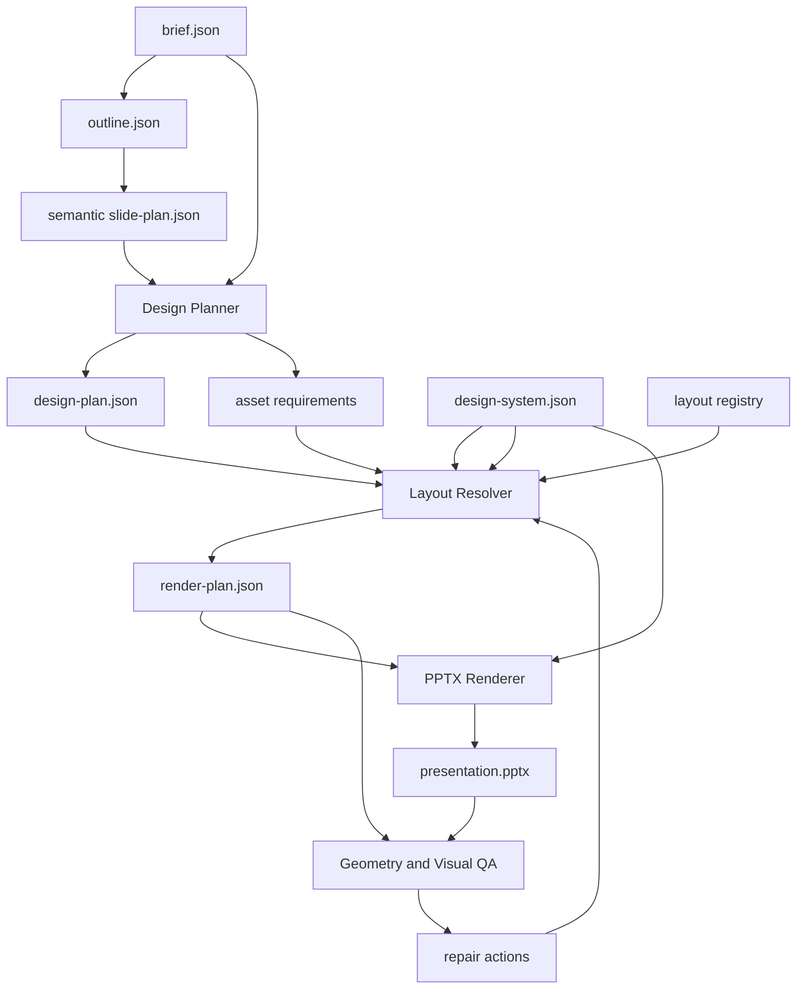

# PPT Agent v2 Architecture

## Product Goal

PPT Agent v2 designs a presentation for an audience and speaking goal. Producing an editable PPTX is the final compilation step, not the product definition.

## Preserved Foundations

- The existing project directory structure remains authoritative.
- `brief.json`, `outline.json`, and `slide-plan.json` remain durable project state.
- Stable slide, block, and element IDs remain the basis for targeted revision.
- The v1 renderer remains available while the v2 pipeline is introduced.

## Adopted Design Ideas

| Reference | Adopted idea | Local implementation |
| --- | --- | --- |
| academic-pptx-skill | Communication job, action titles, ghost-deck test, one primary claim and exhibit | Semantic slide-plan fields and future content QA |
| PPTAgent | Layout capacity metadata and content/image/layout fit | Layout registry and deterministic candidate scoring |
| Presenton | One render tree as the geometry source of truth | `render-plan.json` shared by renderer, QA, and revision |
| Akxan ppt-agent-skill | Style intent, layout decision matrix, cross-slide variation | Design-system policies and Design Planner |
| guizang-ppt-skill | Registered layouts, image-slot discipline, rhythm validation | Layout registry constraints and deck-level QA |
| appautomaton/presentation | Separate story, brand, design, and output responsibilities | Explicit pipeline module boundaries |

No third-party code or template assets are copied. Third-party HTML, WebGL, Konva, agent runtimes, and unlicensed assets are not runtime dependencies.

## Pipeline

## Contract Boundaries

### Semantic Slide Plan

Describes what each slide must communicate. It contains no absolute geometry. Typed content prevents metrics, charts, comparisons, and images from collapsing into bullet strings.

### Design System

Defines semantic design tokens and enforceable policies. It includes typography, spacing, chart and image treatment, permitted layout families, visual rhythm, and forbidden treatments.

### Design Plan

Defines page type, intended layout, visual form, information density, design notes, asset requirements, and quality constraints. It connects semantic content to the future Layout Engine without introducing coordinates.

### Layout Registry

Defines executable layout contracts: compatible content, slots, frames, capacity, typography budgets, fallbacks, previews, and renderer keys. A layout ID is a registered foreign key, not a free-form suggestion.

### Render Plan

Defines exact geometry and style references after layout resolution. It is the single source of truth for rendering, geometry QA, and targeted revision.

## Compatibility

`agent.core.compatibility.upgrade_slide_plan_v1()` converts existing v1 plans into conservative v2 semantic plans without modifying the source. Unknown audience details, evidence, and assets are not invented. Phase 2 enriches those fields from `brief.json`, `outline.json`, and project materials.

The migration strategy is additive:

1. Read v1 and v2 project data.
2. Adapt v1 into semantic v2 in memory.
3. Keep the legacy renderer as a fallback.
4. Introduce v2 layout families one at a time.
5. Preserve unchanged v1 project artifacts.

## Explicit Non-Goals

- Do not let the LLM emit arbitrary slide coordinates.
- Do not maintain parallel HTML, Canvas, SVG, and PPTX render trees.
- Do not make external template repositories runtime dependencies.
- Do not use style prompts as a substitute for layout contracts.
- Do not shrink text below a layout's typography budget to force a fit.

## Delivery Phases

### Phase 1: Contracts and Core Architecture

Add v2 schemas, contract registry, compatibility adapter, and architecture documentation. Do not change rendered output.

### Phase 2: Design Planner

Generate page type, layout intent, visual form, information density, design notes, visual rhythm, and asset requirements. Add deck-level repetition and density checks.

### Phase 3: Layout Engine

Implement layout registry loading, compatibility filtering, deterministic scoring, slot binding, text measurement, fit policies, and render-plan generation.

### Phase 4: Renderer

Render from the render plan, apply design tokens, support images and native charts, preserve element mapping, and run geometry plus visual QA.
