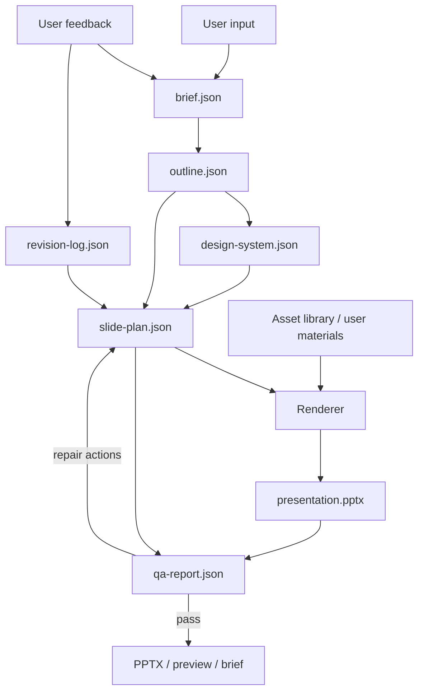

# PPT Agent Architecture

## Module Flow

## Skill Responsibilities

| Skill | Responsibility | Input | Output |
| --- | --- | --- | --- |
| Brief Analyst | Understand request and normalize constraints | User message, material summary | `brief.json` |
| Story Architect | Build narrative and control information density | `brief.json` | `outline.json` |
| Design Director | Select template, colors, fonts, and style rules | `brief.json`, template preference | `design-system.json` |
| Slide Planner | Convert outline into slide-level content and layout intent | `outline.json`, `design-system.json` | `slide-plan.json` |
| PPT Renderer | Generate editable PowerPoint | `slide-plan.json`, assets | `.pptx` |
| PPT Critic | Run layout and content QA with concrete fixes | `.pptx`, `slide-plan.json` | `qa-report.json` |

## Revision Principle

Every rendered object that may be changed later must have a stable element ID in `slide-plan.json`. A revision request should map to one of these scopes:

- Deck-level style or structure.
- One or more slides.
- One or more editable elements.
- A content block within an editable element.

The default revision behavior is minimal change: update the smallest scope that satisfies the user request, then run QA only on affected slides plus a deck-level consistency check.

