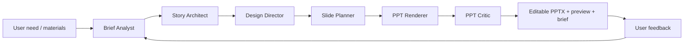

# PPT Agent MVP Product Spec

## Product Definition

The MVP is a focused, verifiable product loop:

1. The user describes a presentation need in natural language.
2. The agent produces a concise presentation plan preview.
3. The user confirms or revises the plan.
4. The agent generates an editable `.pptx`.
5. The user gives a natural-language modification request.
6. The agent updates only the targeted pages or elements and exports again.

The MVP deliberately excludes web research, complex illustration generation, and rewriting existing PowerPoint files. Those belong to later plug-in skills.

## User Input

The user should not be forced into a long form. The MVP accepts natural language plus optional parameters.

| Input | Required | Example |
| --- | --- | --- |
| Topic or task | Yes | "Make a report introducing the new energy vehicle market" |
| Use case | Yes | Classroom presentation, defense, work report, roadshow |
| Audience | Yes | Teacher, customer, management, classmates |
| Page count | No | Default: 10 pages |
| Style | No | Business, academic, minimal, tech |
| Existing materials | No | Text, images, data, template |
| Constraints | No | No English, no dark background |
| Revision request | From second round | "Change slide 4 into a comparison chart and make the whole deck cleaner" |

## Key Product Rule

The agent must output a presentation plan preview before generating the final deck. This reduces rework and makes the generation process reviewable.

## MVP Workflow

## Stages

| Stage | Responsibility |
| --- | --- |
| Understand brief | Extract topic, goal, audience, style, page count, and constraints. Ask only when critical information is missing. |
| Build story | Decide the purpose of each slide, not just a list of titles. |
| Define design | Select template, colors, fonts, layout rules, and slide types. |
| Plan slides | Specify title, key message, content, visual form, layout, and asset needs per slide. |
| Render PPT | Convert the structured slide plan into a native editable `.pptx`. |
| Quality check | Detect overflow, overlap, font-size issues, visual inconsistency, and excessive information density. |
| Iterate | Locate the user-referenced slides and elements, update only what is necessary, then re-check. |

## Visible Outputs

Each completed generation produces three user-facing artifacts:

| Artifact | Purpose |
| --- | --- |
| `presentation.pptx` | Final editable PowerPoint file. |
| `preview.pdf` or slide images | Fast review without opening PowerPoint. |
| `presentation-brief.md` | Topic, page count, style, one-sentence slide summaries, and revision history. |

## Internal State Files

| File | Purpose |
| --- | --- |
| `brief.json` | Normalized user request. |
| `outline.json` | Storyline and slide outline. |
| `design-system.json` | Theme tokens such as palette, fonts, spacing, and component rules. |
| `slide-plan.json` | Per-slide content, layout, assets, editable element IDs, and revision history. |
| `qa-report.json` | Issues, severity, and concrete repair actions. |
| `revision-log.json` | User feedback and the resulting changes. |

## Success Criteria

The MVP is successful when:

- A user can submit a usable request within 2 minutes.
- The agent first returns a reasonable 8 to 12 slide plan.
- The generated file is editable in PowerPoint.
- At least 80% of slides need no manual layout adjustment.
- A user can complete one targeted revision with a single natural-language request.
- A revision does not damage the style or content of unchanged slides.

